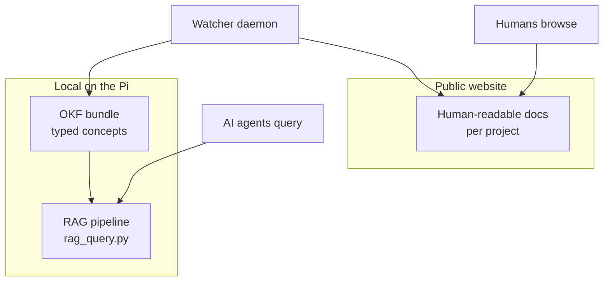

My documentation hub has always been built for humans: MkDocs, a clean
theme, one navigable page per concept. That works well — until you ask an
AI agent to find something in it. An agent doesn't browse; it retrieves.
And plain HTML pages are a poor retrieval target. This post describes how I
made the same knowledge base work for both audiences, running entirely on a
Raspberry Pi 5.

## OKF in sixty seconds

The fix starts with structure. Every concept in my knowledge base is a
single markdown file with typed YAML front matter:

```yaml
---
type: Attested Computation
title: Jellyfin Health Check
description: Verifies that Jellyfin responds to health requests
resource: ./jellyfin-healthcheck.md
tags: [attested-computation, health-check, jellyfin]
sources:
  - id: jellyfin-docker-compose
    resource: ./docker-compose.yml
    title: Jellyfin Docker Compose Configuration
generated:
  by: human:aldo
  at: 2026-08-25T09:15:00Z
verified:
  - by: human:aldo
    at: 2026-08-25T09:15:00Z
status: stable
stale_after: 2027-02-25T09:15:00Z
---
```

The type tells an agent what it is looking at (a node, a service, a runnable
computation). `sources` records provenance, `status` and `stale_after` say
how much to trust it and when to re-check. For computations there is also an
executor script and an attester — deterministic code, no LLM involved — so
an agent can run the check itself and verify the receipt instead of trusting
prose.

## A minimal RAG pipeline

With structured documents in place, retrieval needs three things: embed the
content, index it, answer questions from the nearest neighbours. The whole
pipeline is about a hundred lines of Python:

```python
from sentence_transformers import SentenceTransformer
import faiss

model = SentenceTransformer("all-MiniLM-L6-v2")
embeddings = model.encode(texts)          # one vector per document

index = faiss.IndexFlatL2(embeddings.shape[1])
index.add(embeddings.astype("float32"))

def query(question, k=3):
    q = model.encode([question])
    _, hits = index.search(q.astype("float32"), k)
    return [documents[i] for i in hits[0]]
```

On the Pi this runs fully local: CPU-only PyTorch, no GPU, no cloud calls
during a query. Asking *"What is the Jellyfin health-check command?"*
returns the exact `curl` line with its source file cited, in under a second
once the index is warm. When Mem0 is configured as the provider the vectors
live there instead of in FAISS — same interface, different store.

## What broke along the way

The happy path above took a few detours worth documenting, because each one
is a trap someone else will step in:

**CUDA wheels on a 4 GB tmpfs.** Installing `sentence-transformers` pulls in
PyTorch — and by default the CUDA build, roughly five gigabytes of NVIDIA
libraries for a board without an NVIDIA GPU. pip extracts into `/tmp`, which
on this system is a small memory-backed tmpfs, so the install died with
`No space left on device`. Fix: install `torch` first from the CPU wheel
index, and point `TMPDIR` at the real disk.

**NumPy versus Python 3.13.** Pinning `numpy==1.24.3` fails to build on
Python 3.13; even `1.26.x` refuses to install there. Anything below 2.1 is
off the table on current Debian.

**YAML dates are not JSON.** Front-matter timestamps like
`2026-08-25T09:15:00Z` parse into Python `datetime` objects, which
`json.dumps` refuses to serialise. One `default=str` in the API client fixed
it.

**Positional indices go stale.** Storing documents as "document number 19"
breaks the moment the document list changes between index rebuilds — search
results silently point at the wrong file. Resolving hits by their stored
source path instead makes re-indexing safe.

**A watcher that ate its own tail.** My auto-sync daemon copies changed
docs from each app repository into the hub — including the hub's own
repository, whose docs directory then got re-imported into itself,
recursively. Two directories named identically, dozens of levels deep.
The fix was an explicit scan exclusion plus a test that fails if anyone
re-adds the hub to the scan list.

That last failure taught me the meta-lesson: **every automation bug became
a test**, which is why the pipeline can now be trusted to run unattended.

## Keeping it fresh

Structure and retrieval are worthless if the knowledge base rots. A small
watcher daemon closes the loop: every few minutes it scans the application
repositories for markdown changes, mirrors them into the site and the
knowledge base, invalidates the embedding index, pushes the site repository,
and verifies the live deployment:


An edit in any app's docs reaches the public site within minutes, with no
human in the loop — and if any link of that chain fails, the log says which
one.

## Two doors, one knowledge base

The last decision was the most interesting one: what should be *public*?
Raw machine knowledge — receipts, hashes, internal hostnames, health-check
endpoints — is useful to agents but noise (and mild attack-surface) for
human readers. So the two audiences get separate doors:



The public site keeps the readable documentation plus a short "how to use"
page; everything machine-facing stays on the host, queried locally through
the pipeline. Same source of truth, mirrored automatically — but only the
human door faces the internet.

## Wrap-up

Total cost: one Python file for the pipeline, one watcher script, a handful
of markdown files with front matter. Total benefit: agents answer questions
about my infrastructure with citations, and the knowledge base maintains
itself. The failure stories were the real price of admission — but every
one of them is now a regression test, which is exactly how a knowledge base
for machines should earn trust.
