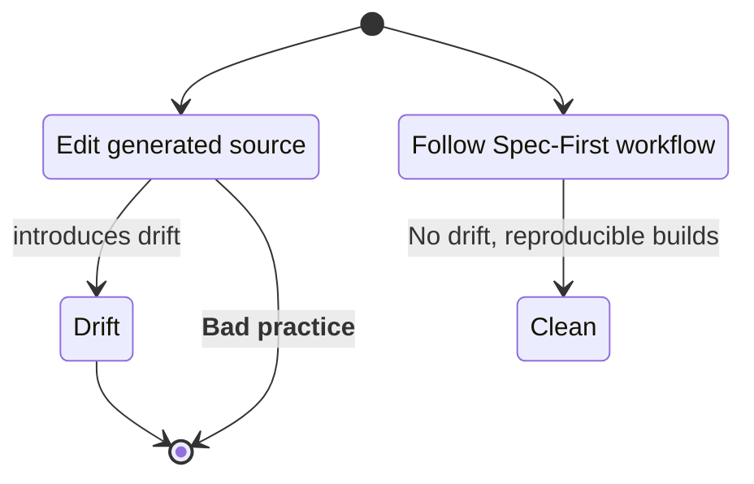

# Spec‑First, Test‑First, Regenerate‑Always

> *“Code is now cheap; verification is not.”* – a succinct reminder that the economics of software development have flipped.

## 1. The problem we’re solving

When generative AI can spit out hundreds of lines of syntactically‑correct code in seconds, the **cost of writing** disappears but the **cost of understanding, verifying, and maintaining** stays high.  If we keep treating that code as a permanent asset, we inherit the same legacy problems: fragile refactors, technical debt, and endless merge wars.  The Phoenix Architecture proposes a different invariant: *the implementation is disposable; the contract and its verification are permanent*.

### The Phoenix Architecture in a nutshell

```mermaid
flowchart LR
    Spec[Spec (OpenAPI / JSON‑Schema)] -->|generator| Stub[Generated stub implementation]
    Stub -->|run| Tests[Automated tests (pytest / hypothesis)]
    Tests -->|pass| CI[CI pipeline – lint, security, deploy]
    CI -->|publish| Site[Live site]
    Tests -->|fail| Iter[Iterate – adjust Spec or Tests]
    Iter --> Stub
```

The diagram captures the **5‑step loop** that replaces the classic edit‑compile‑test cycle.  The implementation (`Stub`) is **never edited by hand** – any change flows through the spec or the test.

## 2. Detailed 5‑step workflow

| Step | Action | Tooling | Result |
|------|--------|---------|--------|
| **1️⃣ Spec** | Write an **OpenAPI** or **JSON‑Schema** contract that describes the public API, data shapes, and invariants. | `openapi-generator-cli`, `datamodel-code-generator` | A single source of truth that survives any code deletion. |
| **2️⃣ Regenerate** | Convert the contract into a stub implementation (e.g. a FastAPI skeleton). | `make spec` (wrapped `openapi-generator`) | Fresh, compilable code with **zero hand‑edited logic**. |
| **3️⃣ Test** | Write a **failing test** that captures the desired behaviour (unit, integration, or property‑based). | `pytest`, `hypothesis` | The test becomes the *oracle* that validates any regenerated code. |
| **4️⃣ Iterate** | Adjust the **spec** or the **test** until `make test` passes. | `make test`, `uv run pytest` | Guarantees that the contract and its verification are in sync. |
| **5️⃣ CI / Deploy** | A GitHub Action runs the whole pipeline on every push and on the scheduled publish date, publishing the MkDocs site. | GitHub Actions, `ruff`, `checkmarx-sast` | Fully automated, repeatable delivery with no manual touch‑up. |

### Example command flow (copy‑paste ready)

```bash
# 1️⃣ Write the contract (hello.yaml)
cat > specs/hello.yaml <<'EOF'
openapi: 3.0.3
info:
  title: Hello service
  version: "1.0"
paths:
  /hello:
    get:
      summary: Return a greeting
      responses:
        '200':
          description: Greeting payload
          content:
            application/json:
              schema:
                type: object
                properties:
                  msg:
                    type: string
                    example: hi
                required: [msg]
EOF

# 2️⃣ Generate a stub implementation
make spec   # runs openapi‑generator → src/main.py (FastAPI skeleton)

# 3️⃣ Write a failing test (tests/test_hello.py)
cat > tests/test_hello.py <<'EOF'
from fastapi.testclient import TestClient
from src.main import app

client = TestClient(app)

def test_hello():
    r = client.get('/hello')
    assert r.status_code == 200
    # Verify the exact payload defined in the spec
    assert r.json() == {"msg": "hi"}
EOF

# 4️⃣ Run the test suite – it will fail the first time because the stub returns an empty dict.
uv run pytest -q tests/test_hello.py

# 5️⃣ Iterate until the test passes (regenerate and re‑run)
make spec && uv run pytest -q tests/test_hello.py

# 6️⃣ CI runs automatically on every push (see .github/workflows/publish-drafts.yml)
```

When `make test` finally succeeds, you have a **verified implementation** that can be rebuilt at any time from the same `hello.yaml` file.

## 3. Toolchain checklist (what you really need)

| Category | Tool (uv‑managed) | Why it belongs in the loop |
|----------|-------------------|---------------------------|
| **Contract generation** | `openapi-generator-cli` (or `datamodel-code-generator`) | Turns a declarative spec into runnable code in one command. |
| **Testing** | `pytest`, `hypothesis` | Provides the *oracle* that validates regenerated code. |
| **Lint / Formatting** | `ruff` | Guarantees style consistency without touching logic. |
| **Security / SCA** | `checkmarx-sast` or `trufflehog` | Scans the generated artefacts before they are shipped. |
| **Automation** | GitHub Actions + `make` (targets: `spec`, `test`) | Runs the full pipeline on every push and on the scheduled publish date. |

All dependencies belong in `pyproject.toml`; `uv sync` reproduces the exact environment on any machine.

## 4. Common pitfalls & how to avoid them



| Pitfall | Symptom | Fix |
|----------|----------|-----|
| **Editing generated files** | Merge conflicts, code‑drift, inability to rebuild from spec. | Add `src/` (or equivalent) to `.gitignore`. Treat it as a build artefact only. |
| **Over‑loading the spec** | Generator exceeds LLM context, errors, or produces huge stub files. | Keep the contract **declarative** – only signatures, schemas, and examples. Separate concerns into multiple spec files if needed. |
| **Tests that mirror the stub** | Regeneration never catches bugs because the test simply checks the same placeholder. | Write tests that assert **behavioural contracts** (business rules, edge‑case handling) rather than implementation details. |
| **Missing CI gate** | Broken builds reach production, security regressions slip through. | Ensure the GitHub Action runs `ruff`, `checkmarx-sast`, and `pytest` **before** publishing. |
| **Skipping the Deletion Test** | You cannot rebuild a fresh clone without errors. | Periodically run `git clean -fdx && make spec && make test` on a clean checkout to verify the whole pipeline works from scratch. |

## 5. Frequently asked questions

**Q: Do I have to keep the generated code in the repo?**
> No. The `src/` directory should be listed in `.gitignore`. Only the spec (`*.yaml`/`*.json`) and the tests live in version control.

**Q: Can I use a language other than Python?**
> Absolutely. The workflow is language‑agnostic; replace the generator (`openapi-generator-cli -g <lang>`) and the test framework accordingly.

**Q: How does this relate to the Phoenix Architecture’s “Deletion Test”?**
> The Deletion Test is a mental checkpoint: *If you delete the entire `src/` tree, can you rebuild a passing system from the remaining artefacts?* This workflow makes that test trivial – just run `make spec && make test` on a fresh clone.

**Q: What if my spec changes frequently?**
> That is expected. Each spec change triggers regeneration, which automatically invalidates old stubs and forces the test suite to fail until the contract and tests are aligned again.

## 6. What’s next?

The next article in this series will dive deeper into each tool:
1. **OpenAPI‑generator** – custom templates, language selection, versioning.
2. **Pytest + Hypothesis** – writing deterministic and property‑based tests that survive regeneration.
3. **Ruff & security scanners** – integrating linting and vulnerability checks into the CI pipeline.
4. **Advanced CI patterns** – branch protection, protected spec releases, and automated version bumping.

Stay tuned, experiment with the snippet above, and you’ll already be practising **regenerative, TDD‑first development**.

---

*Happy coding – may your code be as disposable as a phoenix’s ashes, and your contracts as immutable as its rebirth.*
