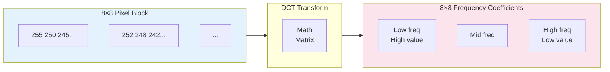
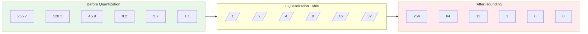
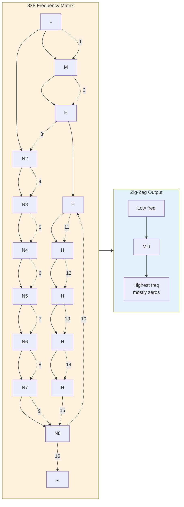

While AI compression tools like **[vibecompress](../2026/09/05/why-store-pixels-when-you-can-store-vibes-meet-vibecompress/)** replace your photos with hallucinations, the humble JPEG format has been doing something completely different for decades: mathematics instead of guessing. Here's exactly how it works.

## The Full Pipeline

Before diving into each step, here's the complete JPEG compression pipeline:

```mermaid
flowchart LR
    A[Input Image<br/>RGB pixels] --> B[Color Space<br/>Conversion]
    B --> C[YCbCr<br/>Y + Cb + Cr]
    C --> D[Chroma<br/>Subsampling]
    D --> E[Split into<br/>8×8 Blocks]
    E --> F[DCT<br/>Frequency Transform]
    F --> G[Quantization<br/>Round to integers]
    G --> H[Zig-Zag<br/>Scan]
    H --> I[Entropy<br/>Coding]
    I --> J[JPEG<br/>Bitstream]

    style A fill:#e1f5fe,stroke:#01579b
    style J fill:#e8f5e9,stroke:#2e7d32
    style G fill:#fff3e0,stroke:#e65100
```

The flow goes from raw RGB pixels through mathematical transforms, with **quantization** (the orange step) being where data is permanently discarded.

<!-- more -->

## What Is JPEG?

JPEG (Joint Photographic Experts Group) is a compression standard for digital photos, introduced in 1992. It's designed to take large images — often several megabytes — and shrink them down to kilobytes, without the human eye immediately noticing the loss.

It uses **lossy compression**: certain information is permanently discarded, but the remaining data stays visually recognizable.

## Step 1: Color Space Conversion

Digital photos typically start as RGB (Red, Green, Blue). JPEG first converts them to **YCbCr**:

- **Y** = brightness (luminance)
- **Cb** = blue color difference
- **Cr** = red color difference

Why? The human eye is far more sensitive to brightness changes than to color detail. That gives us room to cut color information in half in the next step.

## Step 2: Chroma Subsampling

Because we see color less precisely, JPEG halves the resolution of Cb and Cr channels. A 4×4 pixel block goes from 16 color values to 8, while keeping full brightness resolution. This is called **4:2:0 chroma subsampling**.

Result: 50% less color data, with minimal visible effect.

## Step 3: Discrete Cosine Transform (DCT)

Here's where it gets interesting. JPEG splits the image into 8×8 pixel blocks. For each block, it applies the **Discrete Cosine Transform** — a mathematical transformation that converts pixels into frequencies.

Instead of saying "pixel (2,3) is red with value 187", DCT says: "this block consists of:
- 1 average brightness (low frequency)
- A few gentle shadows (mid frequencies)
- No hard edges (no high frequencies)"

The output is an 8×8 matrix of frequency coefficients. The top-left corner holds the lowest frequencies (the "big shapes"), the bottom-right the highest frequencies ("fine details").

Each 8×8 block is transformed independently, turning spatial data (where pixels are) into frequency data (what patterns exist).

## Step 4: Quantization

Now comes the real compression secret. Every frequency coefficient is divided by a **quantization table** and rounded to an integer.

- Low frequencies (important for the look): preserved
- High frequencies (fine texture): reduced or zeroed out

This is the **lossy** step. Details we see less well (high-frequency color, fine patterns) get discarded. Higher compression = coarser rounding = more blocky artifacts ("blockiness") when you zoom in.

The quantization table is adjustable: higher values = more compression = lower quality.

## Step 5: Zig-Zag Scanning

The 8×8 matrix is now linearized into a single long sequence via a **zig-zag pattern**: from top-left (lowest frequency) to bottom-right (highest frequency).

Why? Because after quantization, the bottom-right corner is mostly zeros. Those zeros can be compressed efficiently with run-length encoding.

## Step 6: Entropy Coding

The final step is **entropy coding** (usually Huffman coding). Repeating patterns — like long runs of zeros — get short codes; rare combinations get longer codes.

Result: a compact bitstream that stores the photo.

## The Numbers: What JPEG Compression Looks Like

| Original (RAW) | JPEG (Quality 85) | JPEG (Quality 50) |
|----------------|-------------------|-------------------|
| 20,000 KB      | ~800 KB (96% smaller) | ~200 KB (99% smaller) |

Notably, the "quality 50" version still looks decent at screen size, but shows clear blocking artifacts up close.

## Why This Beats Bitmap

An uncompressed PNG holds 24 bits per pixel (RGB). 1920×1080 = 2,073,600 pixels × 3 bytes = 6 MB.

JPEG hits the same resolution at 100–500 KB. The difference lies in recognizing that photos contain natural smooth gradients, not sharp graphical lines. JPEG is built for photography, not screenshots.

## Limitations

- **Repeated saves**: every re-save loses more detail. Artifacts accumulate.
- **Bad for text**: sharp edges and small letters blur quickly.
- **Blocking artifacts**: high compression reveals a grid pattern in flat areas.

For those use cases, PNG (lossless) or WebP (modern successor) exist. But for photos, JPEG remains the king of scalable compression.

## Summary

JPEG doesn't work by guessing what a photo depicts (like AI tools do). It works by mathematically decomposing the image into frequencies, cutting the unimportant details, and packing the rest more tightly. It's compression through smart deletion, not hallucination.

And that's the essential difference: with JPEG, you know what was in the photo. With AI compression, you only know what *vibe* the photo had.

---

*Related: [Why Store Pixels When You Can Store Vibes? Meet vibecompress](../2026/09/05/why-store-pixels-when-you-can-store-vibes-meet-vibecompress/) — the satirical counterpart that replaces math with LLMs.*