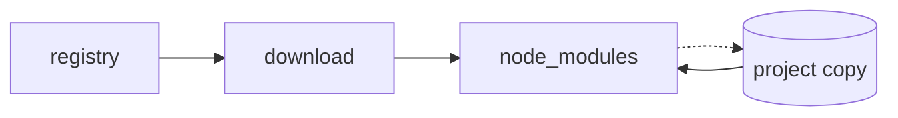
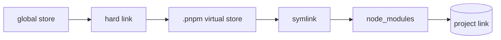
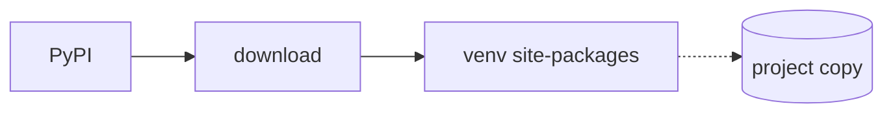

Choosing the right package manager isn't just about convenience—it's about disk space, install speed, and reproducible builds. The wrong choice can bloat your project with duplicate files, while the right one keeps your workspace lean and your CI pipelines humming.

## Quick comparison (interactive)

[pivot-table]

| Tool           | Ecosystem | Store/cache      | Linking      | Fallback | Lockfile          | Speed   | Runtime? | Maturity |
| -------------- | --------- | ---------------- | ------------ | -------- | ----------------- | ------- | -------- | -------- |
| npm            | JS/TS     | ~/.npm           | Copy         | None     | package-lock.json | Slow    | No       | High     |
| pnpm           | JS/TS     | ~/.pnpm-store    | Hard link    | Copy     | pnpm-lock.yaml    | Fast    | No       | High     |
| Bun            | JS/TS     | ~/.bun/bin/cache | Hard link    | Copy     | bun.lockb         | Fastest | Yes      | Medium   |
| pip            | Python    | ~/.cache/pip     | Copy         | None     | requirements.txt  | Slow    | No       | High     |
| uv             | Python    | ~/.uv/cache      | Hard/reflink | Copy     | uv.lock           | Fast    | No       | Medium   |
| [/pivot-table] |

## Install flow diagrams

### npm install flow

### pnpm install flow

### Bun install flow

### pip install flow

### uv install flow

## Which one avoids duplicate files on disk?

npm and pip copy packages per project, so installing the same library across multiple projects stores it multiple times on disk. pnpm, Bun, and uv all link from a shared global store/cache, giving you automatic deduplication.

## The bottom line

When you install the same package version across 10 projects, pnpm/Bun/uv only store it once on disk, while npm/pip store it 10 times. That means you save disk space and reduce CI build times—simple as that.

---

## Bonus: serve raw markdown for AI agents

With the [mkdocs-raw-markdown](https://pypi.org/project/mkdocs-raw-markdown/) plugin, you can serve the original Markdown source by appending `.md` to any page URL. This is handy for AI agents that need the raw content instead of rendered HTML.
