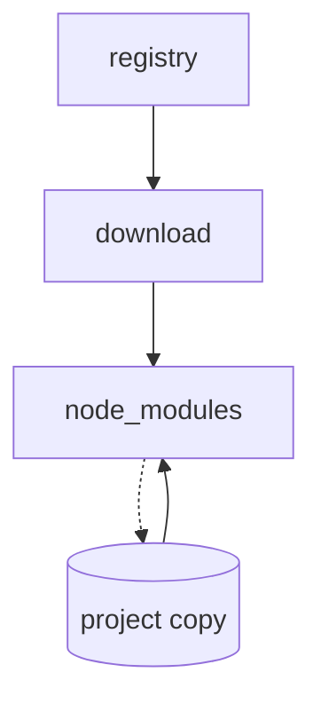
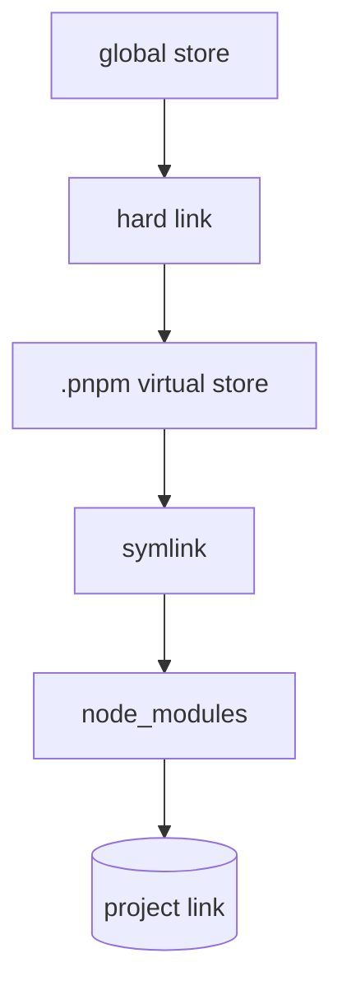
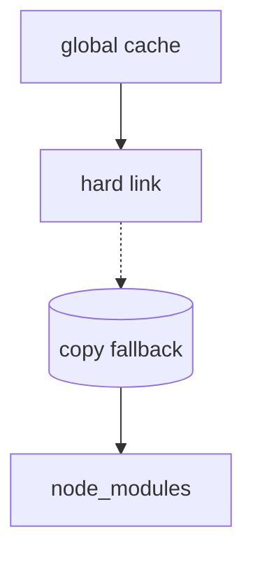
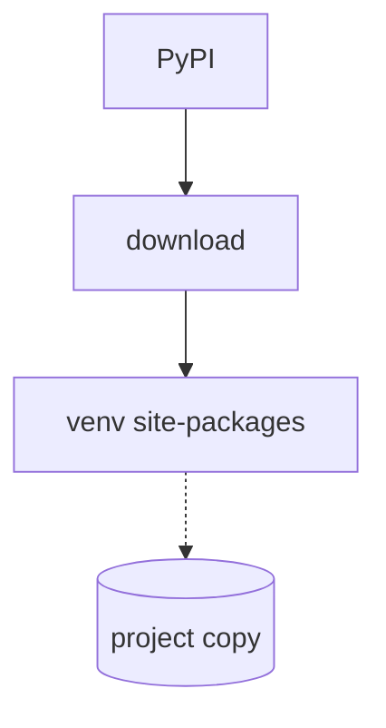
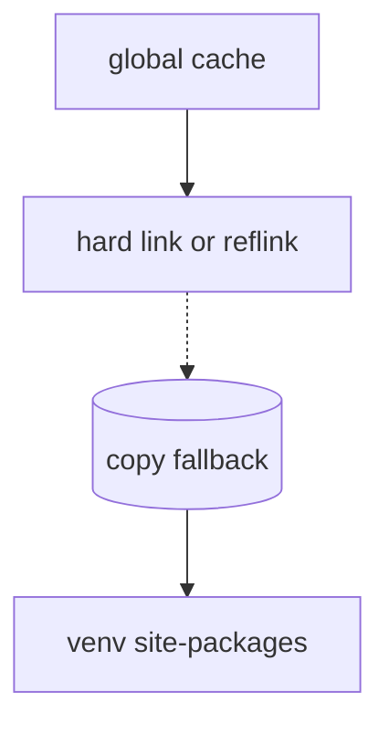

Choosing the right package manager isn't just about convenience—it's about disk space, install speed, and reproducible builds. The wrong choice can bloat your project with duplicate files, while the right one keeps your workspace lean and your CI pipelines humming.

## Quick comparison (interactive)

<small>Swap rows/columns • hide/show columns • state saved to URL + browser</small>

<table id="cmp-table" border="1" cellpadding="6" style="border-collapse:collapse;font-size:0.85rem;width:100%">
<thead><tr>
<th>Tool</th><th>Ecosystem</th><th>Store/cache</th><th>Linking</th><th>Fallback</th><th>Lockfile</th><th>Speed</th><th>Runtime?</th><th>Maturity</th>
</tr></thead><tbody>
<tr><td>npm</td><td>JS/TS</td><td>~/.npm</td><td>Copy</td><td>None</td><td>package-lock.json</td><td>Slow</td><td>No</td><td>High</td></tr>
<tr><td>pnpm</td><td>JS/TS</td><td>~/.pnpm-store</td><td>Hard link</td><td>Copy</td><td>pnpm-lock.yaml</td><td>Fast</td><td>No</td><td>High</td></tr>
<tr><td>Bun</td><td>JS/TS</td><td>~/.bun/bin/cache</td><td>Hard link</td><td>Copy</td><td>bun.lockb</td><td>Fastest</td><td>Yes</td><td>Medium</td></tr>
<tr><td>pip</td><td>Python</td><td>~/.cache/pip</td><td>Copy</td><td>None</td><td>requirements.txt</td><td>Slow</td><td>No</td><td>High</td></tr>
<tr><td>uv</td><td>Python</td><td>~/.uv/cache</td><td>Hard/reflink</td><td>Copy</td><td>uv.lock</td><td>Fast</td><td>No</td><td>Medium</td></tr>
</tbody></table>

  <button id="table-drawer-btn" onclick="toggleDrawer()" style="background:#f5f5f5;border:1px solid #ddd;border-radius:999px;padding:2px 10px;font-size:0.75rem;cursor:pointer;color:#555;font-family:inherit">&#9881; Customize table</button>

  
Click pills to hide/show columns • Strike-through = hidden

  

    Columns:
    <button onclick="toggleCol('eco')"     id="pilleco"     style="background:#e8e8e8;color:#333;border:none;border-radius:999px;padding:1px 7px;font-size:0.7rem;cursor:pointer;box-shadow:0 1px 2px rgba(0,0,0,0.12);transition:all 0.15s;font-family:inherit">Ecosystem</button>
    <button onclick="toggleCol('store')"  id="pillstore"   style="background:#e8e8e8;color:#333;border:none;border-radius:999px;padding:1px 7px;font-size:0.7rem;cursor:pointer;box-shadow:0 1px 2px rgba(0,0,0,0.12);transition:all 0.15s;font-family:inherit">Store</button>
    <button onclick="toggleCol('link')"   id="pilllink"    style="background:#e8e8e8;color:#333;border:none;border-radius:999px;padding:1px 7px;font-size:0.7rem;cursor:pointer;box-shadow:0 1px 2px rgba(0,0,0,0.12);transition:all 0.15s;font-family:inherit">Linking</button>
    <button onclick="toggleCol('fallback')" id="pillfallback" style="background:#e8e8e8;color:#333;border:none;border-radius:999px;padding:1px 7px;font-size:0.7rem;cursor:pointer;box-shadow:0 1px 2px rgba(0,0,0,0.12);transition:all 0.15s;font-family:inherit">Fallback</button>
    <button onclick="toggleCol('lock')"   id="pilllock"    style="background:#e8e8e8;color:#333;border:none;border-radius:999px;padding:1px 7px;font-size:0.7rem;cursor:pointer;box-shadow:0 1px 2px rgba(0,0,0,0.12);transition:all 0.15s;font-family:inherit">Lockfile</button>
    <button onclick="toggleCol('speed')"  id="pillspeed"   style="background:#e8e8e8;color:#333;border:none;border-radius:999px;padding:1px 7px;font-size:0.7rem;cursor:pointer;box-shadow:0 1px 2px rgba(0,0,0,0.12);transition:all 0.15s;font-family:inherit">Speed</button>
    <button onclick="toggleCol('runtime')"id="pillruntime" style="background:#e8e8e8;color:#333;border:none;border-radius:999px;padding:1px 7px;font-size:0.7rem;cursor:pointer;box-shadow:0 1px 2px rgba(0,0,0,0.12);transition:all 0.15s;font-family:inherit">Runtime?</button>
    <button onclick="toggleCol('mature')"id="pillmature"  style="background:#e8e8e8;color:#333;border:none;border-radius:999px;padding:1px 7px;font-size:0.7rem;cursor:pointer;box-shadow:0 1px 2px rgba(0,0,0,0.12);transition:all 0.15s;font-family:inherit">Maturity</button>
  

  

    Rows:
    <button onclick="toggleRow('npm')"  id="rownpm"  style="background:#e8e8e8;color:#333;border:none;border-radius:999px;padding:1px 7px;font-size:0.7rem;cursor:pointer;box-shadow:0 1px 2px rgba(0,0,0,0.12);transition:all 0.15s;font-family:inherit">npm</button>
    <button onclick="toggleRow('pnpm')" id="rownpmpm"style="background:#e8e8e8;color:#333;border:none;border-radius:999px;padding:1px 7px;font-size:0.7rem;cursor:pointer;box-shadow:0 1px 2px rgba(0,0,0,0.12);transition:all 0.15s;font-family:inherit">pnpm</button>
    <button onclick="toggleRow('bun')"  id="rownbun" style="background:#e8e8e8;color:#333;border:none;border-radius:999px;padding:1px 7px;font-size:0.7rem;cursor:pointer;box-shadow:0 1px 2px rgba(0,0,0,0.12);transition:all 0.15s;font-family:inherit">Bun</button>
    <button onclick="toggleRow('pip')"  id="rowpip"  style="background:#e8e8e8;color:#333;border:none;border-radius:999px;padding:1px 7px;font-size:0.7rem;cursor:pointer;box-shadow:0 1px 2px rgba(0,0,0,0.12);transition:all 0.15s;font-family:inherit">pip</button>
    <button onclick="toggleRow('uv')"   id="rowuv"   style="background:#e8e8e8;color:#333;border:none;border-radius:999px;padding:1px 7px;font-size:0.7rem;cursor:pointer;box-shadow:0 1px 2px rgba(0,0,0,0.12);transition:all 0.15s;font-family:inherit">uv</button>
  

  

    <button onclick="swapRC()" style="background:#6366f1;color:#fff;border:none;border-radius:999px;padding:1px 7px;font-size:0.7rem;cursor:pointer;box-shadow:0 1px 2px rgba(0,0,0,0.12);font-family:inherit">Swap rows/cols</button>
    <button onclick="resetTable()" style="background:#e53935;color:#fff;border:none;border-radius:999px;padding:1px 7px;font-size:0.7rem;cursor:pointer;box-shadow:0 1px 2px rgba(0,0,0,0.12);font-family:inherit">Reset</button>
  

## Install flow diagrams

### npm install flow

### pnpm install flow

### Bun install flow

### pip install flow

### uv install flow

## Which one avoids duplicate files on disk?

npm and pip copy packages per project, so installing the same library across multiple projects stores it multiple times on disk. pnpm, Bun, and uv all link from a shared global store/cache, giving you automatic deduplication.

## The bottom line

When you install the same package version across 10 projects, pnpm/Bun/uv only store it once on disk, while npm/pip store it 10 times. That means you save disk space and reduce CI build times—simple as that.
