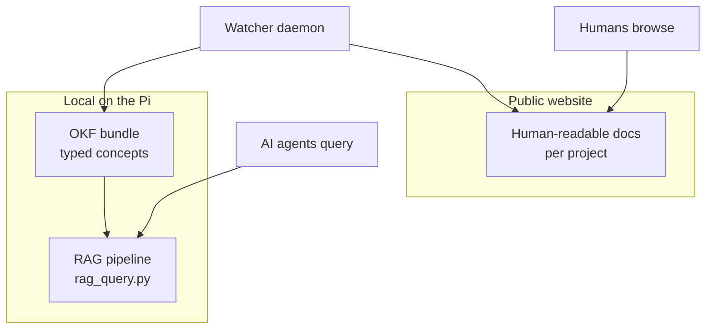

Mijn documentatiecentrum is altijd ontworpen voor mensen: MkDocs, een strak
thema, één overzichtelijke pagina per concept. Dat werkt prima — totdat je een
AI-agent vraagt om er iets in te zoeken. Een agent bladert niet; hij haalt informatie op.
En gewone HTML-pagina’s zijn daar slecht voor geschikt. In dit bericht beschrijf ik hoe ik
dezelfde kennisbank voor beide doelgroepen heb laten werken, volledig draaiend op een
Raspberry Pi 5.

## OKF in zestig seconden

De oplossing begint bij de structuur. Elk concept in mijn kennisbank is een
enkel Markdown-bestand met getypte YAML-frontmatter:

```yaml
---
type: Attested Computation
title: Jellyfin Health Check
description: Verifies that Jellyfin responds to health requests
resource: ./jellyfin-healthcheck.md
tags: [attested-computation, health-check, jellyfin]
sources:
  - id: jellyfin-docker-compose
    resource: ./docker-compose.yml
    title: Jellyfin Docker Compose Configuration
generated:
  by: human:aldo
  at: 2026-08-25T09:15:00Z
verified:
  - by: human:aldo
    at: 2026-08-25T09:15:00Z
status: stable
stale_after: 2027-02-25T09:15:00Z
---
```

Het type geeft een agent aan waar hij naar kijkt (een knooppunt, een dienst, een uitvoerbare
berekening). `sources` registreert de herkomst, `status` en `stale_after` geven aan
in hoeverre het te vertrouwen is en wanneer het opnieuw moet worden gecontroleerd. Voor berekeningen is er ook een
uitvoeringsscript en een verificatieprogramma — deterministische code, zonder tussenkomst van een LLM — zodat
een agent de controle zelf kan uitvoeren en het resultaat kan verifiëren in plaats van af te gaan op
tekstuele beschrijvingen.

<!-- more -->

## Een minimale RAG-pijplijn

Zodra er gestructureerde documenten beschikbaar zijn, zijn er drie stappen nodig voor het ophalen van informatie: de
inhoud insluiten, deze indexeren en vragen beantwoorden op basis van de naaste buren. De hele
pijplijn bestaat uit ongeveer honderd regels Python:

```python
from sentence_transformers import SentenceTransformer
import faiss

model = SentenceTransformer("all-MiniLM-L6-v2")
embeddings = model.encode(texts)          # one vector per document

index = faiss.IndexFlatL2(embeddings.shape[1])
index.add(embeddings.astype("float32"))

def query(question, k=3):
    q = model.encode([question])
    _, hits = index.search(q.astype("float32"), k)
    return [documents[i] for i in hits[0]]
```

Op de Pi draait dit volledig lokaal: PyTorch alleen op de CPU, geen GPU, geen cloudaanroepen
tijdens een zoekopdracht. Als je vraagt *"Wat is het Jellyfin-commando voor de statuscontrole?"*
krijg je de exacte `curl`-regel terug, met vermelding van het bronbestand, in minder dan een seconde
zodra de index is opgewarmd. Wanneer Mem0 als provider is geconfigureerd, staan de vectoren
daar in plaats van in FAISS — dezelfde interface, andere opslagplaats.

## Wat er onderweg misging

Het bovenstaande „happy path“ nam een paar omwegen die het vermelden waard zijn, omdat elke omweg
een valkuil is waar iemand anders in zal trappen:

**CUDA-wheels op een 4 GB tmpfs.** Bij het installeren van `sentence-transformers` wordt
PyTorch meegetrokken — en standaard de CUDA-build, zo’n vijf gigabyte aan NVIDIA-
bibliotheken voor een bord zonder NVIDIA-GPU. pip pakt uit in `/tmp`, wat
op dit systeem een kleine, door het geheugen ondersteunde tmpfs is, dus de installatie mislukte met
`No space left on device`. Oplossing: installeer eerst `torch` vanuit de CPU-wheel-index
en wijs `TMPDIR` naar de echte schijf.

**NumPy versus Python 3.13.** Het vastzetten van `numpy==1.24.3` mislukt bij het bouwen op
Python 3.13; zelfs `1.26.x` weigert daar te installeren. Alles onder 2.1 is
uitgesloten op de huidige Debian.

**YAML-datums zijn geen JSON.** Tijdstempels in de front-matter, zoals
`2026-08-25T09:15:00Z`, worden geparseerd tot Python `datetime`-objecten, die
`json.dumps` weigert te serialiseren. Eén `default=str` in de API-client loste
dit op.

**Positie-indexen raken verouderd.** Het opslaan van documenten als „document nummer 19”
gaat mis zodra de documentlijst verandert tussen het opnieuw opbouwen van de index — zoekresultaten
verwijzen dan stilletjes naar het verkeerde bestand. Het oplossen van treffers op basis van hun opgeslagen
bronpad maakt het opnieuw indexeren daarentegen veilig.

**Een watcher die in zijn eigen staart beet.** Mijn autosynchronisatiedaemon kopieert gewijzigde
documenten vanuit elke app-repository naar de hub — inclusief de eigen
repository van de hub, waarvan de map `docs` vervolgens recursief opnieuw
in zichzelf werd geïmporteerd. Twee mappen met dezelfde naam, tientallen niveaus diep.
De oplossing was een expliciete uitsluiting bij het scannen plus een test die mislukt als iemand
de hub opnieuw aan de scanlijst toevoegt.

Die laatste mislukking leerde me de meta-les: **elke automatiseringsfout werd
een test**, en daarom kan de pijplijn nu zonder toezicht worden uitgevoerd.

## Actueel houden

Structuur en opvraging zijn waardeloos als de kennisbank veroudert. Een kleine
watcher-daemon maakt de cirkel rond: om de paar minuten scant deze de applicatie-
repositories op Markdown-wijzigingen, spiegelt deze naar de site en de
kennisbank, maakt de ingebedde index ongeldig, pusht de site-repository,
en verifieert de live-implementatie:


Een wijziging in de documentatie van een app verschijnt binnen enkele minuten op de openbare site, zonder dat er
een mens aan te pas komt — en als er ergens in die keten iets misgaat, geeft het logboek aan welke
schakel dat is.

## Twee ingangen, één kennisbank

De laatste beslissing was de meest interessante: wat moet *openbaar* zijn?
Ruwe machinegegevens — bonnen, hashes, interne hostnamen, eindpunten voor
statuscontroles — zijn nuttig voor agents, maar ruis (en een klein aanvalsoppervlak) voor
menselijke lezers. Daarom krijgen de twee doelgroepen aparte toegangen:



De openbare site bevat de leesbare documentatie en een korte "gebruiksaanwijzing"-pagina;
alles wat voor machines bestemd is, blijft op de host staan en wordt lokaal opgevraagd via
de pijplijn. Eén enkele bron van waarheid, automatisch gespiegeld — maar alleen de
mensvriendelijke interface is toegankelijk via het internet.

## Samenvatting

Totale kosten: één Python-bestand voor de pijplijn, één watcher-script, een handvol
Markdown-bestanden met frontmatter. Totaal voordeel: agents beantwoorden vragen
over mijn infrastructuur met bronvermeldingen, en de kennisbank onderhoudt
zichzelf. De storingsverhalen waren de echte prijs die ik moest betalen — maar elk
van deze verhalen is nu een regressietest, en dat is precies hoe een kennisbank
voor machines vertrouwen zou moeten winnen.

---

<!-- translated from `en/blog/posts/agent-readable-docs-okf-rag` (en->nl) by deepl on 2026-08-26; review before publishing edits -->
