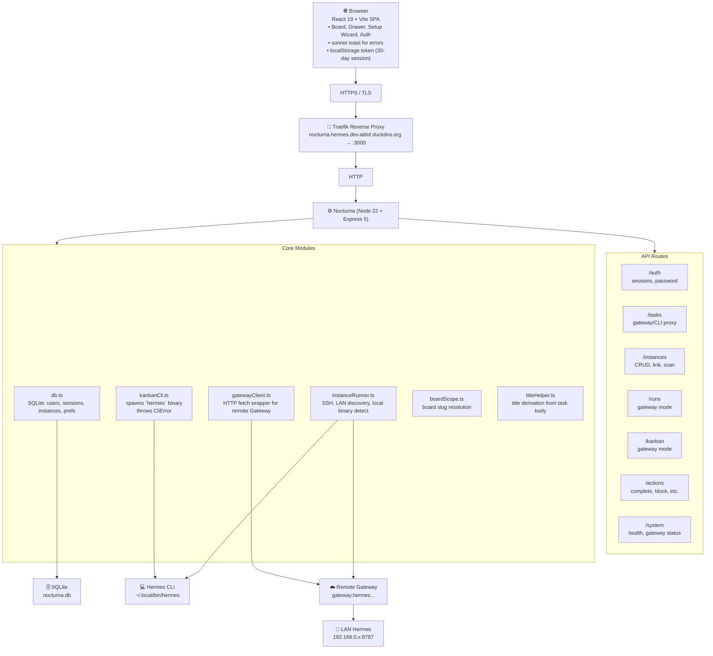

# Nocturna Architecture

> **TL;DR:** Nocturna is a single-process Node 22 app (Express 5 + React 19 + Vite) that talks to Hermes via three backends: Local CLI (subprocess), LAN-discovered Hermes, or remote Gateway (HTTPS). It stores only auth/instance config in SQLite; Hermes owns all task/run/event data.

---

## System Architecture



---

## Module Dependency Hierarchy

Nocturna is a TypeScript monorepo (frontend + server in one project).

```
server.ts                 ← Express entrypoint; mounts apiRouter + Vite/dev fallback
server/apiRouter.ts       ← All /api/* routes; mounts authMiddleware globally
server/db.ts              ← SQLite schema + all DB operations (node:sqlite, no ORM)
server/routes/*.ts        ← Express routers: auth, tasks, runs, instances, kanban, actions, bulk, system
server/kanbanCli.ts       ← Spawns `hermes` CLI via execFile; throws CliError
server/gatewayClient.ts   ← HTTP fetch wrapper for remote Hermes Gateway
server/instanceRunner.ts  ← SSH connections, LAN discovery, local binary detection
server/boardScope.ts      ← Board slug resolution (env HERMES_KANBAN_BOARD or 'nocturna')
server/titleHelper.ts     ← Title derivation from Hermes task body (heading-first rule)

src/App.tsx               ← AuthProvider wraps BoardLayout or AuthStartPage; <Toaster />
src/api/client.ts         ← Typed fetch wrapper; stores session token in localStorage
src/context/AuthContext.tsx
src/hooks/useBoard.ts     ← Board state + 3s polling; idle detection logic lives here
src/components/           ← BoardLayout, Card, Column, TaskDrawer, etc.
src/pages/BoardPage.tsx   ← Main kanban view
src/pages/SetupPage.tsx   ← Instance setup wizard
src/types.ts              ← Single source of truth for all shared TS types
```

**Key architectural principle:** Every server route checks `isGatewayActive(activeInstance)` and branches. `gatewayFetch()` and `runCliJson()` are the only two backends. The `TEST_GATEWAY=1` env var forces gateway mode in tests even without a configured instance. In dev, `Vite` middleware serves the SPA and HMRs the server bundle; in prod, esbuild emits `dist/server.mjs` and `dist/` static assets.

---

## The Data Model

### Nocturna's Database (SQLite via `node:sqlite`)

Exactly four tables:

```sql
-- 1. users
CREATE TABLE users (
  id TEXT PRIMARY KEY,
  username TEXT UNIQUE NOT NULL COLLATE NOCASE,
  password_hash TEXT NOT NULL,       -- crypto.scryptSync(password, salt, 64)
  salt TEXT NOT NULL,                -- 16-byte random hex
  created_at INTEGER NOT NULL
);

-- 2. sessions
CREATE TABLE sessions (
  token TEXT PRIMARY KEY,             -- 32-byte random hex
  user_id TEXT NOT NULL,
  created_at INTEGER NOT NULL,
  expires_at INTEGER NOT NULL,        -- 30 days
  FOREIGN KEY(user_id) REFERENCES users(id) ON DELETE CASCADE
);

-- 3. instances
CREATE TABLE instances (
  id TEXT PRIMARY KEY,
  user_id TEXT NOT NULL,
  name TEXT NOT NULL,
  type TEXT NOT NULL,                 -- 'gateway' | 'ssh' | 'local_cli' | 'lan'
  url TEXT UNIQUE,                    -- partial unique (NULLs allowed, prevents dup gateway/lan)
  password TEXT,                      -- gateway auth
  api_key TEXT,                       -- gateway API key (takes precedence over password)
  ssh_host TEXT, ssh_port INTEGER DEFAULT 22,
  ssh_user TEXT, ssh_password TEXT, ssh_key TEXT, ssh_path TEXT,
  is_default INTEGER DEFAULT 0,
  status TEXT DEFAULT 'unknown',
  last_error TEXT, last_checked INTEGER DEFAULT 0,
  created_at INTEGER NOT NULL,
  FOREIGN KEY(user_id) REFERENCES users(id) ON DELETE CASCADE
);
CREATE UNIQUE INDEX idx_instances_url_unique ON instances(url) WHERE url IS NOT NULL;

-- 4. user_preferences
CREATE TABLE user_preferences (
  user_id TEXT PRIMARY KEY,
  active_instance_id TEXT,
  updated_at INTEGER NOT NULL,
  FOREIGN KEY(user_id) REFERENCES users(id) ON DELETE CASCADE
);
```

### Hermes-side Data (NOT Stored by Nocturna)

| Concept | Storage | Access |
|---------|---------|--------|
| Tasks | Hermes `kanban` board (`~/.hermes/kanban.db` or gateway) | `hermes kanban --json` / `GET /api/kanban` |
| Events | Engine-internal | `hermes events` / `GET /api/events?since=N` |
| Runs | Engine-internal | `POST /api/runs`, `POST /api/runs/approve/{id}` |
| Profiles | Engine-internal | `GET /api/profiles?board=...` |

**Hermes is the truth**; Nocturna is a thin read-write wrapper.

---

## The Request Lifecycle

Every API call follows this exact sequence:

### Step 0: Resolve `activeInstance`

`apiRouter` runs `authMiddleware` first, which loads the user, then resolves `req.activeInstance` from `user_preferences.active_instance_id` (or first instance if none). Unknown instance → 401.

### Step 1: Branch on `isGatewayActive(activeInstance)`

- `type === 'gateway' | 'lan'` → `gatewayFetch(path, { config })` → HTTPS to remote
- `type === 'local_cli' | 'ssh'` → `runCliJson(args, { env })` → spawns `hermes` binary

`TEST_GATEWAY=1` env var forces gateway mode in tests even without a configured instance.

### Step 2: Error Envelope

All API errors return:

```json
{ "error": { "code": "engine_unreachable|cli_error|not_found|validation|forbidden_move|unauthorized|conflict", "message": "...", "detail": "..." } }
```

### Step 3: Web Frontend

`src/api/client.ts` wraps every fetch: adds `Authorization: Bearer ***` from `localStorage`, retries 401 → `/auth/me`, throws `ApiError` on non-2xx, parses JSON or surfaces "Hermes backend is starting" if proxy returns HTML.

### Auth Lifecycle (Separate from API Calls)

| Step | Action |
|------|--------|
| Register | `POST /auth/register` → scrypt hash, 16-byte salt, 30-day session token |
| Login | `POST /auth/login` → returns `{ user, token, activeInstance }` |
| Auto-link | First time: if `discoverLocalHermes()` finds binary, `autoCreated` field in `/instances/auto-detect-local?autoLink=true` is saved as default |
| Active instance | `/instances/:id/select` → updates `user_preferences.active_instance_id` |
| Logout | `POST /auth/logout` → server deletes session row; client clears `localStorage` |

### Task Status Moves (CRITICAL)

`PATCH /tasks/:id/status` is **forbidden** (returns 409 `forbidden_move`). Status transitions go through lifecycle action endpoints: `/complete`, `/block`, `/unblock`, `/request-review`, `/request-changes`, `/promote`, `/archive`. The engine owns its state machine; Nocturna refuses to bypass it.

---

## Backend Modes

### Gateway Mode (HTTP)

```typescript
// server/gatewayClient.ts
export async function gatewayFetch<T>(path: string, opts: { config: InstanceRecord }): Promise<T> {
  const base = opts.config.url?.replace(/\/$/, '');
  const headers: Record<string, string> = { 'Content-Type': 'application/json' };
  if (opts.config.api_key) headers['Authorization'] = `Bearer ${opts.config.api_key}`;
  else if (opts.config.password) headers['X-Hermes-Password'] = opts.config.password;
  const res = await fetch(`${base}${path}`, { ...opts, headers });
  if (!res.ok) throw new GatewayError(res.status, await res.text());
  return res.json();
}
```

| Header | When |
|--------|------|
| `Authorization: Bearer ***` | Always if `api_key` set |
| `X-Hermes-Password: <password>` | If `api_key` empty and `password` set |

### CLI Mode (Subprocess)

```typescript
// server/kanbanCli.ts
export async function runCliJson<T>(args: string[], opts: { env: Record<string, string> }): Promise<T> {
  return new Promise((resolve, reject) => {
    execFile(NOCTURNA_HERMES_BIN, args, { env: opts.env, timeout: 30_000 }, (err, stdout) => {
      if (err) return reject(new CliError(err.message, stdout));
      try { resolve(JSON.parse(stdout) as T); }
      catch (e) { reject(new CliError('non-JSON', stdout)); }
    });
  });
}
```

| Setting | Value |
|---------|-------|
| `NOCTURNA_HERMES_BIN` | Path to `hermes` binary (default: `~/.local/bin/hermes`) |
| `HERMES_KANBAN_BOARD` | Board slug (default: `nocturna`) |
| Timeout | 30s per call |

---

## Frontend Architecture

### State

| Source | Holds | Refresh |
|--------|-------|---------|
| `AuthContext` | `user`, `instances`, `activeInstance`, `setShowAuthModal` | On login/logout/switch |
| `useBoard` hook | `tasks`, `events`, `idleSince` | 3s polling |
| `localStorage` | `nocturna_session_token` (30d) | On login/logout |

### Component Tree

```
<App>
  <Toaster position="bottom-right" richColors closeButton />   ← sonner
  <AuthProvider>
    {isLoading ? <Spinner /> : !user ? <AuthStartPage /> : <BoardLayout />}
  </AuthProvider>
</App>

<BoardLayout>
  <Navbar (board switcher, instance selector, logout) />
  <BoardPage>               ← main kanban
    <IdleIndicator (banner if no task created in N minutes) />
    <Column status="todo"> <Card /> ... </Column>
    <Column status="doing"> ... </Column>
    <Column status="done"> ... </Column>
  </BoardPage>
  <BulkBar (when cards selected) />
  <TaskDrawer (right slide-in on card click)>
    <TaskActions (complete, block, archive, etc.) />
  </TaskDrawer>
  <InstancesModal (settings: list, add, discover-lan) />
  <ShortcutModal (press ? to open) />
</BoardLayout>
```

### Polling vs Real-time

Currently 3s polling on `useBoard`. WebSocket / SSE planned but not implemented.

---

## API Surface

All routes are mounted under `/api/`. Auth required unless noted.

### Auth

| Method | Path | Body | Returns |
|--------|------|------|---------|
| POST | `/auth/register` | `{ username, password }` | `{ user, token, instances, activeInstance }` |
| POST | `/auth/login` | `{ username, password }` | `{ user, token, activeInstance }` |
| POST | `/auth/logout` | — | `{ ok: true }` |
| GET | `/auth/me` | — | `{ user, activeInstance }` |

### Instances

| Method | Path | Purpose |
|--------|------|---------|
| GET | `/instances` | List all user instances + active id |
| POST | `/instances` | Create (`url` UNIQUE constraint enforces no dup) |
| PUT | `/instances/:id` | Update (name, url, type, ssh_*, api_key) |
| DELETE | `/instances/:id` | Remove |
| POST | `/instances/:id/select` | Set as active |
| POST | `/instances/:id/set-default` | Set `is_default=1` |
| POST | `/instances/:id/test` | Test connection to saved instance |
| POST | `/instances/test-connection` | Test arbitrary unsaved settings |
| POST | `/instances/auto-detect-local?autoLink=true` | Find host binary, optionally auto-link |
| POST | `/instances/discover-lan` | Scan LAN for Hermes instances |

### Tasks / Kanban (Proxied to Active Backend)

| Method | Path | Notes |
|--------|------|-------|
| GET | `/tasks?board=&status=&assignee=&archived=&limit=` | List with filters |
| GET | `/tasks/:id` | Detail + events + runs + children |
| POST | `/tasks` | Create (gateway/CLI proxy) |
| PATCH | `/tasks/:id` | Edit title/body/priority/assignee |
| DELETE | `/tasks/:id` | Soft delete (archive) |
| GET | `/boards` | List boards |
| GET | `/kanban?board=` | Full board state |
| POST | `/kanban` | Update board state |

### Lifecycle Actions (CRITICAL — Not Direct Status PATCH)

| Endpoint | Transition |
|----------|-----------|
| `POST /tasks/:id/complete` | → `done` |
| `POST /tasks/:id/block` | → `blocked` |
| `POST /tasks/:id/unblock` | → `todo` (or previous) |
| `POST /tasks/:id/request-review` | → `review` |
| `POST /tasks/:id/request-changes` | → `changes_requested` |
| `POST /tasks/:id/promote` | move to next column |
| `POST /tasks/:id/archive` | `archived=1` |

### Bulk + System

| Method | Path | Notes |
|--------|------|-------|
| POST | `/tasks/bulk` | `{ ids, action, arg }` |
| GET | `/events?since=N&board=` | Engine events since N |
| POST | `/runs` | Trigger a run |
| POST | `/runs/approve/:id` | Approve pending run |
| GET | `/health` | `{ status, engine, stats }` |
| GET | `/gateway/status` | Reachability + config check |

---

## Security

### Auth

- **Password hashing**: `crypto.scryptSync(password, salt, 64)`; salt is 16-byte random hex per user.
- **Session tokens**: 32-byte random hex, 30-day expiry, stored server-side in `sessions` table; `localStorage` key is `nocturna_session_token`.
- **No JWTs.** Sessions are server-side and revocable.

### Per-user Isolation

Every query is scoped by `user_id` from the session. `getInstanceById(id, userId)` returns 404 if the instance belongs to a different user. The `user_preferences` table has a `PRIMARY KEY (user_id)`, so a user has at most one `activeInstance`.

### Network

- **Default bind**: `127.0.0.1:3000`. Set `NOCTURNA_ALLOW_REMOTE=1` to bind `0.0.0.0`.
- **CORS**: `NOCTURNA_CORS_ORIGINS` env var (comma-separated).
- **Traefik front**: `*.aldof.duckdns.org` with `ipAllowList` middleware in production.
- **TLS**: Let's Encrypt via Traefik; no plain HTTP in production.

### Data at Rest

- SQLite file at `/app/data/nocturna.db` (in-container) or `./data/nocturna.db` (dev). Owner=container user; `chmod 666` if rebuilding.
- No `data/` in git; `data/nocturna.db` is `.gitignore`d.
- No telemetry. No third-party calls (the only outbound traffic is to the configured Hermes backend).

### What NOT to Commit

- `data/nocturna.db` (user accounts, password hashes, session tokens, instance credentials)
- `.env` (gateway password, api keys)
- `.hermes/config.yaml` (host-side config containing real secrets)

---

## Operations

### Environment Variables

| Variable | Default | Purpose |
|----------|---------|---------|
| `PORT` | `3000` | Express listen port |
| `NODE_ENV` | — | `production` for prod build |
| `HERMES_API_URL` / `HERMES_WEBUI_GATEWAY_BASE_URL` | — | Primary Hermes Gateway URL |
| `HERMES_WEBUI_GATEWAY_USE_RUNS_API` | `false` | Enable runs API |
| `HERMES_WEBUI_PASSWORD` | — | Gateway auth password |
| `HERMES_CUSTOM_FREELLM_ALDOF_DUCKDNS_ORG_API_KEY` | — | Optional API key (precedence over password) |
| `NOCTURNA_HERMES_BIN` | auto-detect | Override `hermes` binary path |
| `HERMES_KANBAN_BOARD` | `nocturna` | Default board slug |
| `SQLITE_DB_PATH` | `./data/nocturna.db` | Override DB file |
| `DISABLE_HMR` | `false` | Disable Vite HMR (used in CI) |
| `NOCTURNA_ALLOW_REMOTE` | `false` | Bind `0.0.0.0` instead of `127.0.0.1` |
| `NOCTURNA_CORS_ORIGINS` | — | Comma-separated allowlist |
| `TEST_GATEWAY` | `false` | Force gateway mode in tests |

### Build & Deploy

```bash
# local
npm install
npm run dev          # vite + tsx server, HMR
npm run build        # vite + esbuild → dist/
npm start            # node dist/server.mjs
npm test             # vitest
npm run test:e2e     # playwright (auto-starts dev server on :3000)
npm run lint         # tsc --noEmit

# docker
docker compose -f templates/infra/06-apps-nocturna/docker-compose.yml up -d --build

# via ansible (preferred)
cd ~/dev && ./install.sh --tags containers --limit-services '["06-apps-nocturna"]'
```

### Observability

| What | Where |
|------|-------|
| Container health | `docker ps` → `Up (health: healthy)` |
| Server logs | `docker logs nocturna --tail 100` |
| Hermes binary | `docker exec nocturna /home/nocturna/.hermes/hermes-agent/hermes version` |
| LAN discovery | `curl -sk -X POST .../api/instances/discover-lan -d '{}'` |
| Healthcheck | `curl -sk .../api/health` → `{ status, engine, stats }` |

### Backup

The DB is a single SQLite file. Backup is a `cp data/nocturna.db` away. Tracked for the lab's nightly backup.

---

## Known Limitations

| # | Limitation | Detail |
|---|------------|--------|
| 1 | **No compile-time query validation** | `db.ts` uses `db.prepare()` (runtime) not a typed query layer. |
| 2 | **No rate limiting** | `authMiddleware` doesn't rate-limit `/auth/login`. |
| 3 | **No WebSocket / SSE** | Board uses 3s polling. |
| 4 | **No multi-board UI** | `useBoard` only knows one board at a time. |
| 5 | **No i18n** | All copy is English. |
| 6 | **Coverage gate at 0%** | `npm run test:coverage` runs, but no `--cov-fail-under` enforced. |
| 7 | **Playwright E2E flaky** | Some specs fail against real server. |
| 8 | **No hot config reload** | Adding an instance is immediate (DB-driven). |
| 9 | **`PORT` env conflict** | `app.tsx` defaults to `3000` but Traefik also expects `3000`. |

---

## Appendix A: Source Pointers

| Concept | File |
|---------|------|
| Express bootstrap | `server.ts` |
| API routes | `server/apiRouter.ts`, `server/routes/*.ts` |
| SQLite schema | `server/db.ts` |
| Auth middleware | `server/routes/auth.ts` |
| CLI subprocess | `server/kanbanCli.ts` |
| Gateway HTTP | `server/gatewayClient.ts` |
| LAN discovery | `server/instanceRunner.ts` (`scanLanForHermes`) |
| React app root | `src/App.tsx` |
| API client | `src/api/client.ts` |
| Auth state | `src/context/AuthContext.tsx` |
| Board state | `src/hooks/useBoard.ts` |
| UI theming | `src/index.css` (Tailwind v4 tokens) |
| Dockerfile | `Dockerfile` |
| Compose | `docker-compose.yml` + `01-core-infra/templates/infra/06-apps-nocturna/` |

---

## Appendix B: Build References

- Hermes Agent docs: https://hermes-agent.nousresearch.com/docs
- Spec-kit (`spec-kit v1.0.4`): https://github.com/github/spec-kit/releases/tag/v1.0.4
- Nocturna spec: [`specs/000-nocturna/spec.md`](../specs/000-nocturna/spec.md)
- Nocturna build guide: [`specs/000-nocturna/build-guide.md`](../specs/000-nocturna/build-guide.md)
- Nocturna data model: [`specs/000-nocturna/data-model.md`](../specs/000-nocturna/data-model.md)
- Nocturna contracts: [`specs/000-nocturna/contracts/api.md`](../specs/000-nocturna/contracts/api.md)