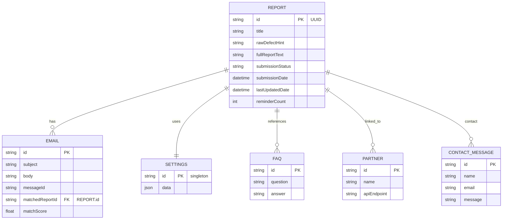

# Storage / Persistence Specification

## 1. Current Storage Mechanism
The application currently uses a **simple file‑based JSON persistence** implemented in `server/services/storage.ts`.  All domain objects (reports, settings, emails, FAQ, partners, contact messages) are stored as individual JSON files under a `data/` directory at the project root.  Helper functions `readJsonFile` / `writeJsonFile` read the whole file into memory, modify it, and write it back atomically.

*Pros*: easy to set up, no external service required, works for a prototype.
*Cons*: limited scalability, no concurrent write safety, no query capabilities, fragile against data loss.

---

## 2. Chosen Persistence Strategy
After evaluating alternatives (SQLite, PostgreSQL, MongoDB, cloud object stores) the recommended production‑grade solution is **SQLite** embedded in the Node.js process using the `better-sqlite3` library.

* Reasons:
  - Zero‑install, file‑based like the current approach – easy migration.
  - ACID transactions give reliable concurrency handling.
  - Supports SQL queries for reporting and analytics.
  - Works on both local dev and Docker containers without extra services.
  - Sufficient for the expected data volume (hundreds to low‑thousands of reports).

---

## 3. Data Model (ER / Mermaid Diagram)


*The diagram captures the core entities and their relationships.  Additional tables (e.g., `timeline_event`, `photo`) can be added later without affecting existing data.*

---

## 4. Migration Steps (JSON → SQLite)
1. **Add SQLite dependency**: `npm install better-sqlite3`.
2. **Create migration script** (`scripts/migrate-json-to-sqlite.ts`):
   - Open (or create) `data/urbanfix.db`.
   - Create tables matching the ER diagram.
   - Read each existing JSON file (`reports.json`, `emails.json`, …) using the existing helper functions.
   - Insert rows inside a single transaction for atomicity.
   - Preserve IDs to keep external references intact.
3. **Run migration**: `npm run migrate-json` (script will be added to `package.json`).
4. **Update `storage.ts`** to use SQLite for all CRUD operations.  Keep the old JSON functions behind a feature flag (`USE_JSON`) for a graceful rollout.
5. **Deploy**: on first start, if `urbanfix.db` does not exist, the migration script runs automatically.

---

## 5. Backup & Retention Policy
| Item | Frequency | Retention | Method |
|------|------------|-----------|--------|
| SQLite DB (`urbanfix.db`) | Daily at 02:00 UTC | 30 days | Copy to `backups/` directory and compress (`gzip`). |
| JSON archive (pre‑migration) | One‑time before migration | Keep forever (optional) | Store in `archive/` with commit hash reference. |
| Incremental backups | Hourly snapshots (WAL files) | 7 days | Use SQLite WAL checkpointing and copy `-wal`/`-shm` files. |

Backups are uploaded to the configured object‑storage bucket (`/storage` service) if the environment variable `BACKUP_BUCKET` is set.

---

## 6. Concurrency Handling
SQLite provides **transactional isolation**.  All write operations in the new storage layer will be wrapped in `BEGIN IMMEDIATE` transactions, ensuring that only one writer can modify the database at a time while allowing unlimited concurrent readers.

For additional safety a **optimistic lock** is added to the `REPORT` table:
```sql
ALTER TABLE report ADD COLUMN version INTEGER NOT NULL DEFAULT 0;
```
When updating a report the application will:
1. SELECT the current `version`.
2. UPDATE with `WHERE version = :currentVersion` and increment `version = version + 1`.
3. If `rowCount === 0` → conflict, retry or reject with a 409 response.

This protects against lost updates from parallel API calls.

---

## 7. Future Extensions
- **Full‑text search** using SQLite FTS5 for email bodies and report texts.
- **Shardable storage**: move to PostgreSQL when data grows beyond a few hundred thousand rows.
- **Encryption at rest**: enable SQLite encryption extension if required by regulations.

---

*Prepared by the development team – specification ready for implementation.*